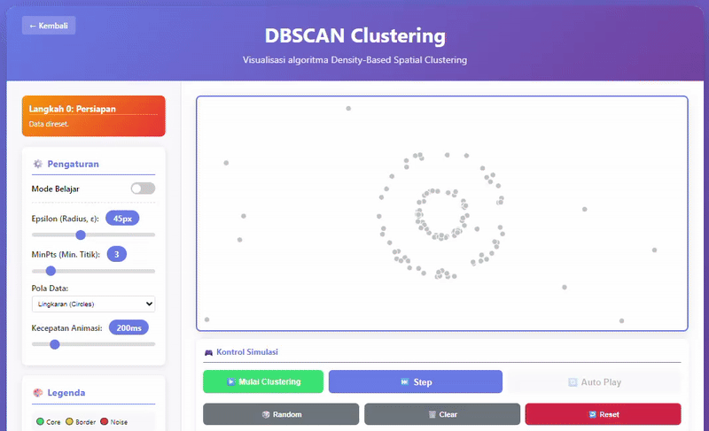

# ML Demo - Simulasi Algoritma Pembelajaran Mesin

Repository ini berisi kumpulan demo dan simulasi interaktif untuk algoritma dan metode yang diajarkan dalam Mata Kuliah Pembelajaran Mesin, diimplementasikan menggunakan HTML/JavaScript.

## 📚 Daftar Demo

### Supervised Learning
- **Linear Regression** - Visualisasi regresi linear dengan gradient descent
- **Error Metrics** - Playground interaktif untuk memahami MAE, MSE, RMSE, dan MAPE
- **K-Nearest Neighbors (KNN)** - Demo KNN interaktif untuk klasifikasi dengan visualisasi 2D
- **Support Vector Machine (SVM)** - Visualisasi SVM dengan berbagai kernel (Linear, Polynomial, RBF)

### Unsupervised Learning
- **K-Means Clustering** - Visualisasi interaktif algoritma clustering step-by-step
- **DBSCAN Clustering** - Visualisasi clustering berbasis kepadatan (Density-Based)
- **Hierarchical Clustering** - Visualisasi Agglomerative Clustering & Dendrogram

## 🎬 Preview

### DBSCAN Clustering


## 🚀 Cara Menggunakan

Setiap demo dapat dijalankan langsung di browser tanpa instalasi tambahan:

1. Clone repository ini
2. Buka file `index.html` di root folder untuk melihat daftar semua demo
3. Atau buka langsung file HTML di folder masing-masing demo

## 📁 Struktur Folder

```
ml-demo/
├── index.html              # Halaman utama dengan daftar semua demo
├── assets/                 # Asset bersama (CSS, JS, images)
│   ├── css/
│   ├── js/
│   └── images/             # Gambar dan animasi untuk README
├── supervised/             # Demo supervised learning
└── unsupervised/           # Demo unsupervised learning
```

## 🛠️ Teknologi

- HTML5
- CSS3
- Vanilla JavaScript
- Canvas API untuk visualisasi

## 👨‍💻 Pembuat

**Galih Hermawan**
- 🌐 Demo: [galih.eu](https://galih.eu/ml-demo/index.html)
- 💼 GitHub Personal: [@galihboy](https://github.com/galihboy)
- 🎓 GitHub Akademik: [@Galih-Hermawan-Unikom](https://github.com/Galih-Hermawan-Unikom)
- 🏫 Prodi Teknik Informatika - Universitas Komputer Indonesia (UNIKOM)

## 📝 Lisensi

MIT License
